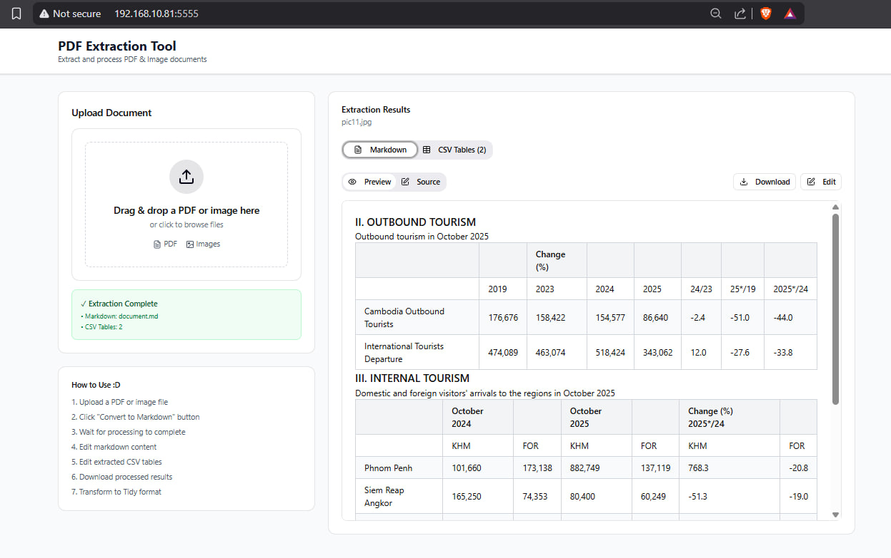
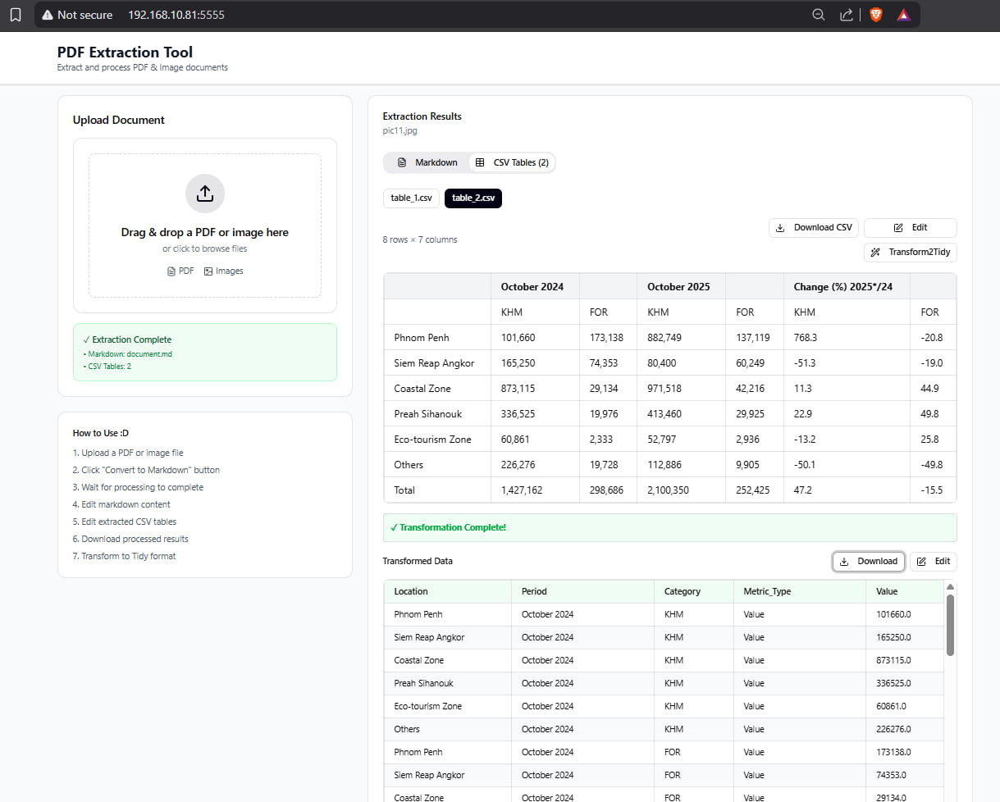
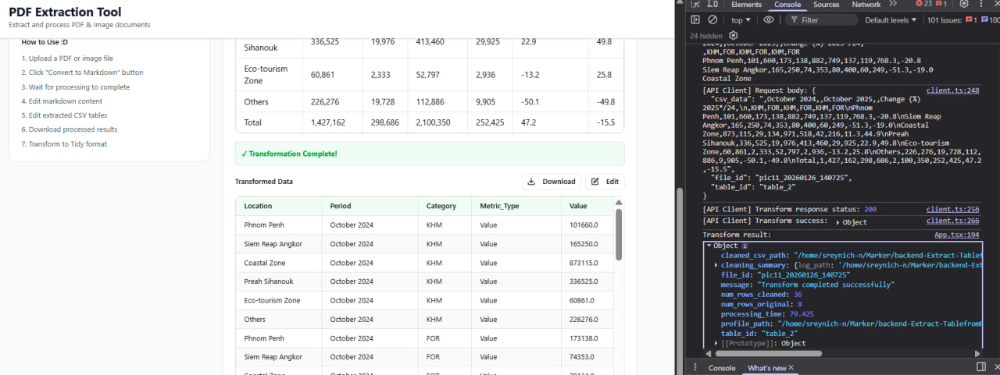
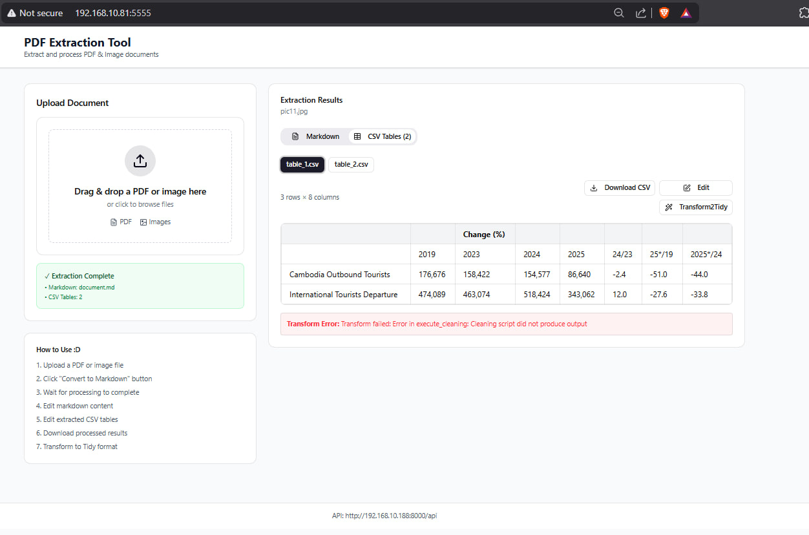

# About
A web UI application for extracting and processing PDF and image documents with a FastAPI backend offers a comprehensive solution for automatically extract tabular data from PDF documents, clean and normalize the extracted content, and transform it into structured, tidy datasets that follow Hadley Wickham’s Tidy Data principles.


---
---

---
---

---
---


## File Structure
```
fullstack_pdf2md_transform2tidy/
├── backend/
│   ├── Dockerfile
│   ├── environment.yml
│   └── app/main.py
├── frontend/
│   ├── Dockerfile
│   ├── package.json
│   └── src/
└── docker-compose.yml
```
## Frontend Workflow
```
┌──────────────────────────────────────────────────────────────────────┐
│                    FRONTEND (React/Vite)                             │
├──────────────────────────────────────────────────────────────────────┤
│  main.tsx  ──►  App.tsx  ──►  Components                             │
│     │                │               │                               │
│     │                │               ├── FileUpload.tsx              │
│     │                │               ├── ResultsPanel.tsx            │
│     │                │               ├── MarkdownViewer.tsx          │
│     │                │               └── CsvViewer.tsx               │
│     │                │                                               │
│     │                └────► api/client.ts ────► FastAPI Backend      │
│     │                                      (192.168.10.188:8000/api) │
│     │                                                                │
│     └── styles/ (Tailwind CSS + custom themes)                       │
└──────────────────────────────────────────────────────────────────────┘
```
## Backend Workflow

## Docker

- Don forget to set the api key in the `\backend\app\services\transform2tidy\.env.transform2tidy` or you can export your won api key in the command which is `export LLM_API_KEY="your_api_key_here"`, which you can get the api key from [link](https://aistudio.google.com/app/api-keys)

- Check
  - `docker --version`
  - `docker compose version`
- Clone the Repository
  - `git clone https://github.com/sreynich-nang/fullstack_pdf2md_transform2tidy.git`
  - `cd fullstack_pdf2md_transform2tidy`
- Build and Start the App
  - `docker compose build`
  - `docker compose up`
  - backend
  ```docker
  docker run --gpus all -p 8000:8000 \
  -v $(pwd)/backend:/app \
  -v $(pwd)/backend/temp:/app/temp \
  fullstack_pdf2md_transform2tidy-backend:latest \
  sh -c "conda run -n TorchMarker uvicorn app.main:app --host 0.0.0.0 --port 8000 --reload"
  ```
  - frontend
  ```docker
  docker run -p 5555:5555 \
  -v $(pwd)/frontend:/app \
  -v /app/node_modules
  fullstack_pdf2md_transform2tidy-frontend:latest
  ```

- Visit the browser
  - Backend: `http://localhost:8000` or `http://localhost:8000/docs`
  - Frontend: `http://localhost:5555`
- Stop the App
  - `docker compose down` or "CTRL + C"

# Limitation

Not all wide-table enable to be transformed to tidy by this pipeline due to LLM limitation working on those errors after Marker did its job which convert from PDF to Markdown. In testing step, among the 10 tables, there a table that is broken which not able to be converted to be Tidy format.

Understand more from the backend side, please refer to `backend` directory :D
