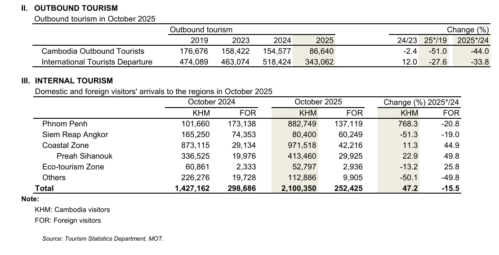
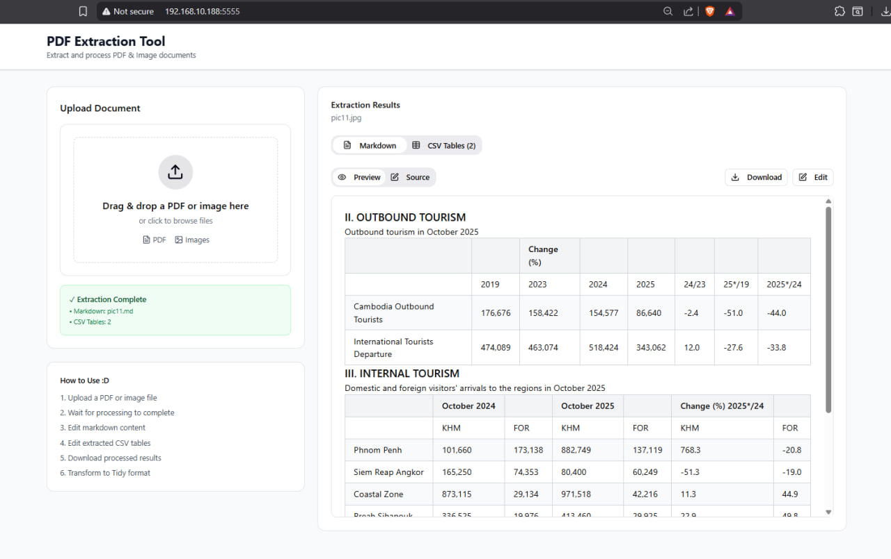
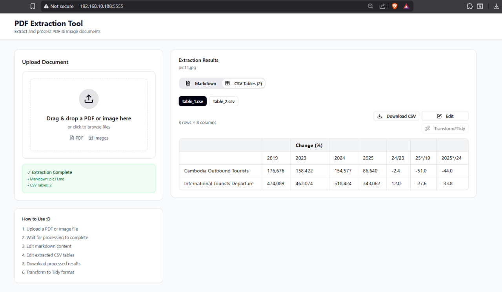
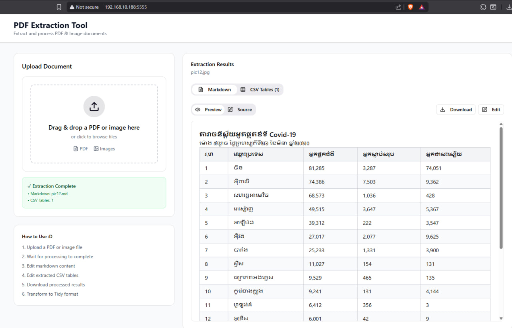
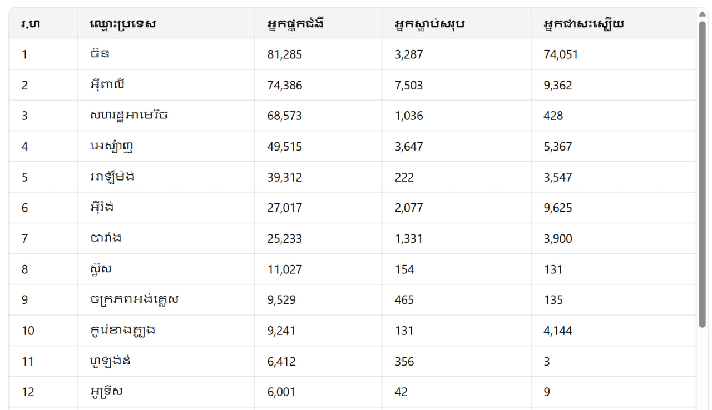

# PDF Extraction Tool

A web application for extracting and processing PDF and image documents with the FastAPI backend.

## Features

- **Drag & Drop Upload**: Upload PDF or image files with an intuitive drag-and-drop interface
- **Real-time Processing**: Monitor extraction progress with live status updates
- **Markdown Preview & Editing**:
  - Switch between preview and source view
  - Edit markdown content inline
  - Save and download edited versions
- **CSV Table Management**:
  - View multiple extracted CSV files
  - Edit tables with inline editing
  - Add/delete rows
  - Edit headers and cell values
  - Download CSV files
  - Transform CSV data to tidy format with a single click on Transfrom2Tidy
- **Version Management**: Save edited versions of both markdown and CSV files

### Demo
#### English Version



#### Khmer Version




## Backend API Configuration

The application is configured to connect to your FastAPI backend at:

```
http://192.168.10.188:8000/api
```

### API Endpoints

The application expects the following endpoints:

1. **POST** `/api/upload` - Upload a file

   - Accepts: multipart/form-data with file
   - Returns: `{ task_id: string, status: string }`
2. **GET** `/api/status/{task_id}` - Check processing status

   - Returns:

   ```json
   {
     "status": "processing" | "completed" | "error",
     "result": {
       "markdown": {
         "content": "string",
         "filename": "string"
       },
       "csv_files": [
         {
           "filename": "string",
           "headers": ["string"],
           "data": [["string"]]
         }
       ]
     },
     "error": "string (if error)"
   }
   ```
3. **POST** `/api/transform2tidy` - Transform CSV to tidy format

   - Accepts: `{ data: string[][], headers: string[] }`
   - Returns: Transformed data

### Changing the API URL

You can change the API URL in `/src/app/api/client.ts`:

```typescript
const API_BASE_URL = 'http://your-api-url:port/api';
```

Or set it via environment variable:

```bash
VITE_API_BASE_URL=http://your-api-url:port/api
```

### File Processing Flow

### Image Upload

1. User uploads an image file
2. Backend processes and returns:
   - One markdown file
   - One CSV file

### PDF Upload

1. User uploads a PDF file
2. Backend processes and returns:
   - One markdown file
   - Multiple CSV files (filtered tables)

## Usage

1. **Upload**: Drag and drop or click to select a PDF or image file
2. **Wait**: Monitor the processing status in real-time
3. **View**: Switch between Markdown and CSV tabs to view extracted content
4. **Edit**: Click "Edit" to modify markdown or CSV content
5. **Save**: Click "Save" to store your changes (version management)
6. **Download**: Download individual files (markdown or CSV)
7. **Transform**: Use the "Transform2Tidy" button to clean up CSV data

## Technical Stack

- **Frontend Framework**: React 18 with TypeScript
- **Styling**: Tailwind CSS v4
- **UI Components**:
  - Radix UI primitives
  - shadcn/ui components
- **File Handling**: react-dropzone
- **Markdown Rendering**: react-markdown with remark-gfm
- **Notifications**: Sonner

## Development

```bash
# Git Clone
git clone https://github.com/sreynich-nang/project-repo.git

cd project-repo

# touch .env
.env

# nano .env
VITE_API_BASE_URL=http://backend_ipaddress:port_number/api

# Install dependencies
npm install

# Start development server (local)
npm run dev 

npx vite --host 0.0.0.0 --port 4000

# Build for production
npm run build
```

## Project Structure

```
/src/app/
  ├── App.tsx                 # Main application component
  ├── components/
  │   ├── FileUpload.tsx      # Drag-and-drop upload component
  │   ├── ResultsPanel.tsx    # Results display with tabs
  │   ├── MarkdownViewer.tsx  # Markdown preview and editor
  │   ├── CsvViewer.tsx       # CSV table viewer and editor
  │   └── ui/                 # Reusable UI components
  ├── api/
  │   └── client.ts           # API client with mock support
  └── types/
      └── index.ts            # TypeScript type definitions
```

```
┌──────────────────────────────────────────────────────────────────────┐
│                    FRONTEND (React/Vite)                             │
├──────────────────────────────────────────────────────────────────────┤
│  main.tsx  ──►  App.tsx  ──►  Components                             │
│     │                │               │                               │
│     │                │               ├── FileUpload.tsx              │
│     │                │               ├── ResultsPanel.tsx            │
│     │                │               ├── MarkdownViewer.tsx          │
│     │                │               └── CsvViewer.tsx               │
│     │                │                                               │
│     │                └────► api/client.ts ────► FastAPI Backend      │
│     │                                      (192.168.10.188:8000/api) │
│     │                                                                │
│     └── styles/ (Tailwind CSS + custom themes)                       │
└──────────────────────────────────────────────────────────────────────┘

```

## Notes

- The application polls the backend every 2 seconds to check processing status
- All edited content is stored in the browser's memory (client-side version management)
- Files are downloaded directly to the user's device
- The Transform2Tidy button is disabled until CSV data is available
